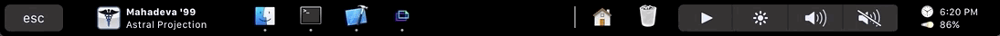
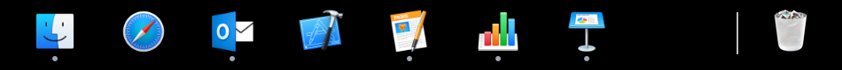
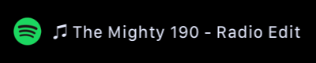
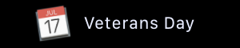
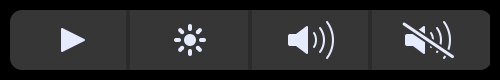
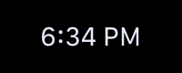
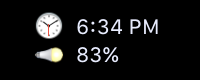
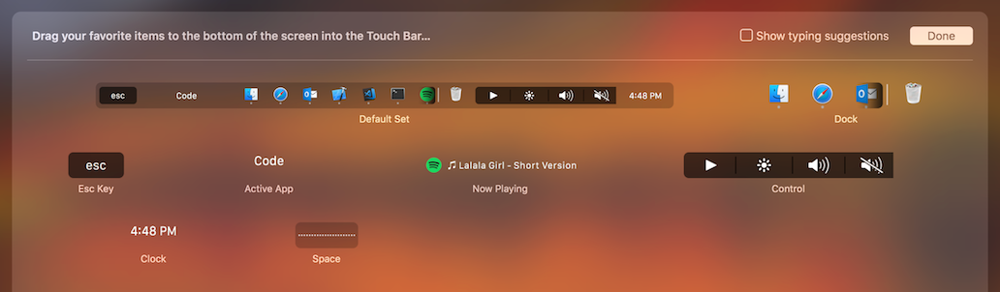

<h1 align="center">
    EnergyBar &middot; Supercharge your Mac's Touch Bar 
</h1>

    
    

     
    Icon by Georg Bednorz

EnergyBar replaces your Mac's Touch Bar with a collection of widgets, such as a Dock or a "Now Playing" widget. The goal of EnergyBar is to maximize the Touch Bar's usability, while minimizing some of its flaws such as inadvertent tapping.

The default placement of EnergyBar widgets allows for consistency and memorization of your Touch Bar use. The areas around the Esc key and above the Delete key have been kept non-functional to alleviate the problem of inadvertent tapping. At the same time EnergyBar allows for customization so that you only have your favorite widgets visible.

## Widgets

### Dock

- Shows your applications, folders and trash can.
- Tap items on the Dock to launch your applications or access your folders and trash can.
- Alternatively click items on the Dock using your mouse. You can even drag files to it and it will do the right thing!
- Hide the system Dock to regain valuable screen real estate.

### Active App

- Shows the currently active app on your Mac.
- This is a display widget that is also used to occupy space that is often tapped inadvertently.

### Now Playing

- Shows the currently playing track and artist.
- Can be configured to show the Active App on tap.
- Can be configured to show the TODO widget on tap.
- Long press to launch the current media player.

### TODO

- Shows the next TODO item from your reminders or calendar events.
- Can be incorporated into the Now Playing widget to preserve space.
- Long press to launch the Reminders or Calendar app.

### Control

- Shows common keyboard controls: play/pause, brightness, volume, mute.
- Press and hold the play/pause button to skip backward/forward.
- Press and hold the brightness and volume buttons to change their value in one action.

### Weather

- Shows the current weather at your location (requires Location Services).
- Uses Apple's private frameworks so you will get the same weather as the one in Notification Center.

### Clock

- Shows the current time and optionally the battery status.
- Can be configured to show the weather on tap.
- Long press to launch the EnergyBar Settings.
- This is a display widget that is also used to occupy space that is often tapped inadvertently.

## Touch Bar Customization

To customize your touch bar press the "Customize Touch Bar" button in the Energy Bar Settings. To open the Settings window simply double-click on the EnergyBar application in the Finder or long press on the Clock widget.

## Developer Notes

The project source code is organized as follows:

* :file_folder: [build/Xcode](build/Xcode): Xcode workspace
* :file_folder: [rsc](rsc): project resources
* :file_folder: [src](src): project sources
    * :file_folder: [src/System](src/System): macOS system sources
    * :file_folder: [src/Widgets](src/Widgets): widget sources

### How to add a Widget

Adding a widget is fairly simple:

- Create a class named `XxxxWidget` that derives from `NSCustomTouchBarItem` or the convenience class `CustomWidget`. It is important that the class name ends in `Widget`.
- Add the class name (without the `Widget` part) to `-[AppBarController awakeFromNib]`.
- Implement your widget.
