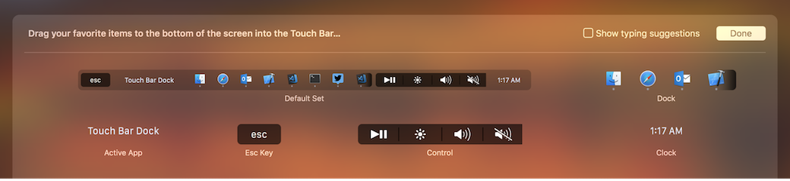
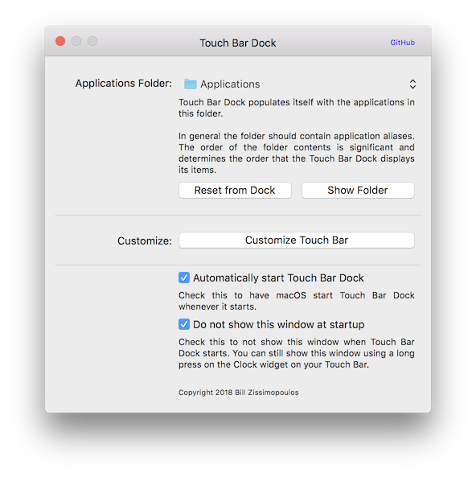

<h1 align="center">
    EnergyBar &middot; Supercharge your Mac's Touch Bar
    
</h1>

    

## Dock

- Manage and launch your favorite applications from a Dock in your Touch Bar.
- Hide the system Dock to regain valuable screen real estate.

## Trash

- Access your Mac's trash can.

## Control

- Common keyboard controls: play/pause, brightness, volume, mute.

## Customize

- Customize your EnergyBar.

## Settings

- General settings for EnergyBar.
