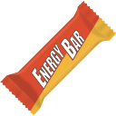

<h1 align="center">
    EnergyBar &middot; Supercharge your Mac's Touch Bar
    
</h1>

    

EnergyBar replaces your Mac's Touch Bar with a collection of widgets, such as a Dock or a "Now Playing" widget. The goal of EnergyBar is to maximize the Touch Bar's usability, while minimizing some of its flaws such as inadvertent tapping.

The default placement of EnergyBar widgets allows for consistency and memorization of your Touch Bar use. The areas around the Esc key and above the Delete key have been kept non-functional to alleviate the problem of inadvertent tapping. At the same time EnergyBar allows for customization so that you only have your favorite widgets visible.

## Widgets

### Dock

- Manage and launch your favorite applications from a Dock in your Touch Bar.
- Access your Mac's trash can.
- Hide the system Dock to regain valuable screen real estate.

### ActiveApp

- Shows the currently active app on your Mac.
- This is a display widget that is also used to occupy space that is often tapped inadvertently.

### NowPlaying

- Shows the currently playing track and artist.
- Tap to change the display between track and artist.
- Long press to launch the current media player.

### Control

- Shows common keyboard controls: play/pause, brightness, volume, mute.
- Long press the play/pause button to skip to the next song.

### Clock

- Shows the current time.
- Long press to launch the EnergyBar settings.
- This is a display widget that is also used to occupy space that is often tapped inadvertently.

## Touch Bar Customization

To customize your touch bar press the "Customize Touch Bar" button in the Energy Bar Settings. To open the Settings window simply double-click on the EnergyBar application in the Finder or long press on the Clock widget.

## Developer Notes

The project source code is organized as follows:

* :file_folder: [build/Xcode](build/Xcode): Xcode workspace
* :file_folder: [rsc](rsc): project resources
* :file_folder: [src](src): project sources
    * :file_folder: [src/System](src/System): macOS system sources
    * :file_folder: [src/Widgets](src/Widgets): widget sources

### How to add a Widget

Adding a widget is fairly simple:

- Create a class named `XxxxWidget` that derives from `NSCustomTouchBarItem` or the convenience class `CustomWidget`. It is important that the class name ends in `Widget`.
- Add the class name (without the `Widget` part) to `-[AppBarController awakeFromNib]`.
- Implement your widget.
