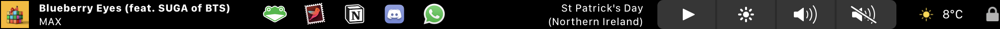

<h1 align="center">
    A customized (personalised) fork of EnergyBar 
</h1>

This version of the app revamps the look of certain widgets to achieve a more minimal design.

## Changes
### To-Do Widget
- Removed calendar icon
- Realigned to the right (instead of the centre)

### Now Playing Widget
- Added album art support (credit to iamslan, but still buggy)
    - The bug seems to be within NowPlaying.m, issue where updateInfo and updateState will conflict and will return appIcon instead of albumArt.
- Realigned to the left (instead of the centre)
- Removed long tap function

### Weather Widget
- Removed area information
- Changed font size and spacing

### Lock Widget
- Made widget smaller

### Control Widget
- Increased responsiveness
- Removed long touch function

### Dock
- Reduced size of icon and changed spacing

## Developer Notes

The project source code is organised as follows:

* :file_folder: [build/Xcode](build/Xcode): Xcode workspace
* :file_folder: [rsc](rsc): project resources
* :file_folder: [src](src): project sources
    * :file_folder: [src/System](src/System): macOS system sources
    * :file_folder: [src/Widgets](src/Widgets): widget sources
